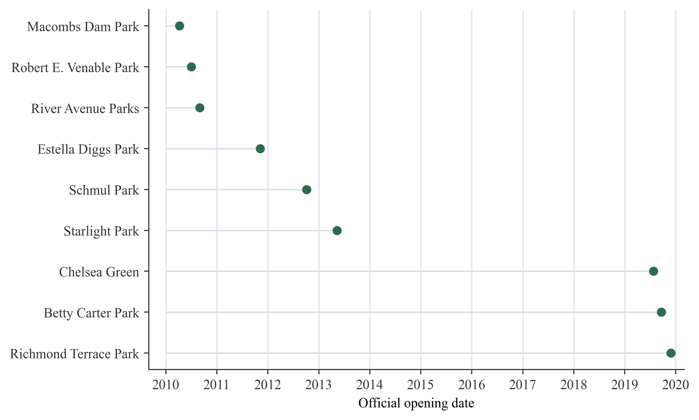
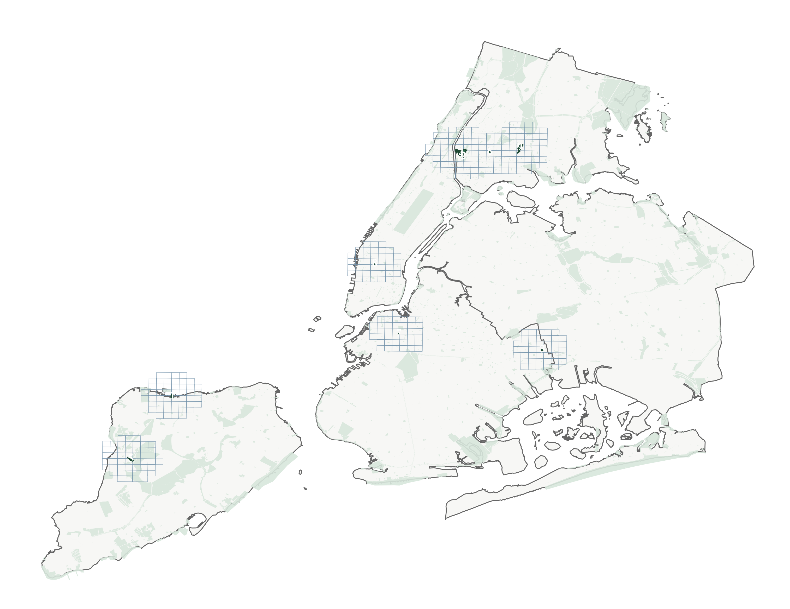
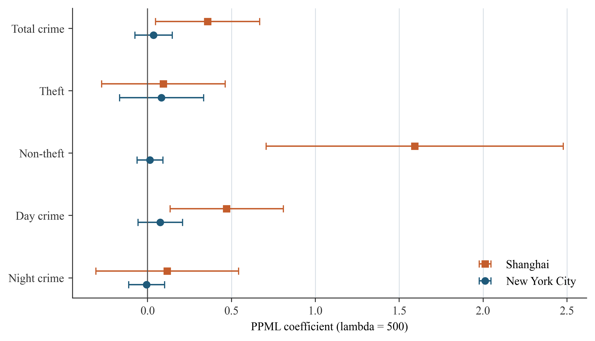
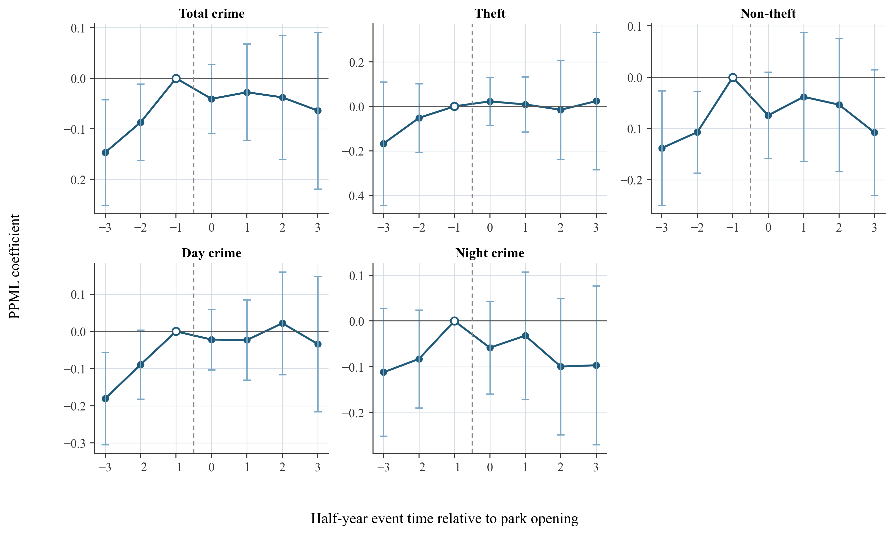

# Park Openings and Recorded Crime in Shanghai and New York City

## A Reproducible Cross-City Event-Study Replication

**Technical report | 7 August 2026**

## Executive finding

This study tests whether the positive post-opening association found around newly opened parks in Shanghai travels to New York City when the same core spatial-temporal logic is applied to official New York data. It does not. In the central continuous-exposure PPML specification, the New York City coefficient for total crime is 0.035 (SE = 0.057, p = 0.538), compared with 0.357 (SE = 0.159, p = 0.024) in Shanghai. The New York estimates are also statistically indistinguishable from zero for theft, non-theft, daytime crime, and nighttime crime. Binary distance-threshold models, a sample restricted to first or genuinely new openings, exclusion of cells potentially exposed to another focal opening, unit-specific linear trends, and leave-one-park-out checks do not change that conclusion.

The New York evidence cannot, however, be interpreted as a clean causal zero. Joint lead tests reject the no-pretrend null for total crime, non-theft crime, and daytime crime. The event-study coefficients show that more-exposed New York cells were already on a different trajectory before the focal opening. The defensible conclusion is therefore narrower: **Shanghai's positive post-opening pattern does not replicate in the current New York design, and the New York sample contains pre-opening dynamics that prevent a strong causal interpretation.**

This is an informative transportability result rather than a direct effect-size contest. Shanghai outcomes are geocoded adjudicated judgment records, whereas New York outcomes are NYPD complaint records. The two data-generating processes capture different stages of the criminal justice process. The comparison demonstrates how the same empirical framework behaves in a second global city, but it does not establish that the two coefficients measure precisely the same underlying crime process.

## 1. Research question and scope

The analysis addresses two questions:

1. Does a newly opened park produce a detectable change in nearby recorded crime in New York City under the spatial event-study framework developed for Shanghai?
2. Are cross-city differences robust to alternative exposure definitions, opening-event restrictions, overlapping treatment, local trends, and influential individual parks?

The New York workflow was built from official public data without modifying any Shanghai input or output. It discovers candidate openings from the NYC Parks press-release archive, validates dates and project scope, matches each event to an official park polygon, downloads incident-dated NYPD complaints around each park, constructs a stacked grid-half-year panel, estimates PPML models, and compares the central coefficients with the corrected Shanghai results.

## 2. Official data and event construction

### 2.1 Data sources

The New York analysis uses three official sources:

- **NYC Parks press-release archive**, used to identify and document public opening dates: https://www.nycgovparks.org/news/press-releases/
- **NYC Parks Properties**, used for current park boundary polygons: https://data.cityofnewyork.us/resource/enfh-gkve.geojson
- **NYPD Complaint Data Historic**, used for incident date, time, coordinates, law category, and offense label: https://data.cityofnewyork.us/resource/qgea-i56i

The automated release index covered 821 NYC Parks releases dated 2010-2019 and identified 213 broad opening-keyword candidates. These candidates were not treated as valid events automatically. Each retained event had to satisfy four requirements: an official source-linked opening statement; day-level timing; a valid match to a Parks property polygon; and substantive scope consistent with a new park, first public opening, replacement park, complete rebuild, or rebuilt and expanded park. Routine renovation of a playground, court, field, comfort station, or isolated amenity was excluded.

Nine opening events enter the main analysis. Hunter's Point South Park is retained in the audit ledger but excluded from the main design because its 2018 release concerns a new phase while the current polygon also contains an earlier phase. Six of the nine main events meet the stricter definition of a first or newly created public park; replacement, complete-rebuild, and rebuilt-expansion events are retained in the baseline and removed in a sensitivity analysis.

### 2.2 Valid focal events

| Park | Borough | Opening date | Opening class | Area (ha) |
|---|---:|---:|---|---:|
| Macombs Dam Park | Bronx | 9 Apr 2010 | Replacement opening | 17.843 |
| Robert E. Venable Park | Brooklyn | 2 Jul 2010 | New park from scratch | 1.194 |
| River Avenue Parks | Bronx | 31 Aug 2010 | New pocket parks | 0.276 |
| Estella Diggs Park | Bronx | 7 Nov 2011 | New park opening | 0.372 |
| Schmul Park | Staten Island | 5 Oct 2012 | Complete rebuild/reopening | 2.991 |
| Starlight Park | Bronx | 10 May 2013 | Rebuilt and expanded opening | 6.980 |
| Chelsea Green | Manhattan | 26 Jul 2019 | First public opening | 0.096 |
| Betty Carter Park | Brooklyn | 20 Sep 2019 | First public opening | 0.094 |
| Richmond Terrace Park | Staten Island | 26 Nov 2019 | First public opening | 4.527 |

### 2.3 Crime records and outcome construction

For each focal park, official NYPD historic complaints were queried within the event-specific temporal window and a geographic bounding box, then clipped locally to 1,500 metres from the park polygon. The workflow retains felony and misdemeanor complaints and assigns time using `cmplnt_fr_dt` and `cmplnt_fr_tm`, which represent the reported occurrence date and time rather than the later complaint-record entry date.

The resulting file contains 385,181 park-stack case rows, representing 305,626 unique complaints across the nine stacks. Incident date and coordinate completeness are 100 percent after validation. Because a complaint may lie within the support of more than one focal park, the stack-row total is intentionally larger than the unique-complaint total.

Five outcomes are constructed in each stack-grid-half-year:

- **Total crime:** all retained felony and misdemeanor complaints.
- **Theft:** complaints whose offense description contains `LARCENY`.
- **Non-theft:** total crime minus theft.
- **Day crime:** complaints occurring from 06:00 through 17:59.
- **Night crime:** complaints occurring from 18:00 through 05:59.

The identities total = theft + non-theft and total = day + night pass exactly in the constructed panel. Theft accounts for 26.5 percent of the New York stack-case records. Day and night records account for 50.2 and 49.8 percent, respectively.

## 3. Spatial-temporal design

### 3.1 Stacked local grid panel

Each opening forms its own event stack. A 500-metre square grid is created in UTM Zone 18N and intersected with a 1,500-metre support around the focal park polygon. Distance is measured from the grid cell to the focal park boundary. Calendar half-years are indexed relative to the opening half-year from event time -3 through +3, with -1 as the omitted reference period in dynamic models.

The balanced design contains 426 park-by-grid units, 345 unique physical grid cells, seven periods per stack unit, and 2,982 stack-grid-half-year rows. Between 41 and 60 local grid cells enter each focal stack. All 385,181 stack-case rows are assigned to an analysis cell and period.

Unlike the sparse Shanghai judgment panel, the NYPD complaint panel is dense: 79.5 percent of total-crime observations are positive, and 19.0 percent of total-crime stack units are always zero. PPML automatically removes fixed-effect groups that provide no outcome variation; the effective central-model sample is therefore 2,415 observations for total crime and between 2,387 and 2,408 for the disaggregated outcomes.

### 3.2 Continuous distance-decayed treatment

The predetermined spatial weight for grid cell u and focal park p is

**K_up(lambda) = exp[-d_up / lambda],**

where d_up is distance in metres from the grid cell to the focal park boundary. The treatment exposure is

**A_upt(lambda) = K_up(lambda) x Post_pt,**

where Post_pt equals one from the focal park's opening half-year onward. The central scale is lambda = 500 metres, with 250 and 1,000 metres used as sensitivity scales.

For count outcome Y_upt, the PPML conditional mean is

**E[Y_upt | A_upt, alpha_up, delta_pt] = exp[beta A_upt(lambda) + alpha_up + delta_pt].**

The stack-by-grid fixed effect alpha_up absorbs stable differences between a local cell and its focal park, including the baseline distance weight. The stack-by-half-year fixed effect delta_pt absorbs period shocks shared by all cells in the same focal event stack. Consequently, beta is identified by whether more-exposed and less-exposed cells within the same park stack change differently after opening. Standard errors are clustered by physical grid cell.

This is a continuous-treatment design. It requires the counterfactual trends of cells at different exposure intensities to be parallel within a stack, a stronger condition than the standard binary parallel-trends assumption. The dynamic lead coefficients and their joint tests are therefore central diagnostics rather than optional embellishments.

### 3.3 Binary threshold and dynamic specifications

Binary robustness models replace the smooth decay function with indicators for being within 250, 500, or 1,000 metres of the focal boundary after opening. These models are binary-threshold PPML specifications with the same fixed effects; they are not labelled as Wooldridge ETWFE or response-scale ATT estimators.

The dynamic event-study replaces the single post-opening interaction with event-time-specific interactions between baseline exposure K_up(500) and event-time indicators. Event time -1 is omitted. The model therefore tests whether exposure gradients were already associated with different changes before opening and how the gradient evolves afterward.

### 3.4 Overlapping treatment

Nineteen percent of opening-period cells are within 1,500 metres of another focal park that had already opened. The baseline stack assigns exposure only with respect to that stack's focal park, so this creates a possible interference channel. A dedicated robustness analysis removes these potentially contaminated cells. The coefficients remain close to zero, indicating that overlapping focal openings do not explain the New York non-replication.

## 4. Main comparative results

### 4.1 Central continuous-exposure estimates

| Outcome | Shanghai beta (SE) | Shanghai p | New York beta (SE) | New York p |
|---|---:|---:|---:|---:|
| Total crime | 0.357 (0.159) | 0.024 | 0.035 (0.057) | 0.538 |
| Theft | 0.094 (0.188) | 0.616 | 0.083 (0.128) | 0.517 |
| Non-theft | 1.592 (0.452) | <0.001 | 0.013 (0.039) | 0.738 |
| Day crime | 0.471 (0.172) | 0.006 | 0.075 (0.068) | 0.265 |
| Night crime | 0.117 (0.217) | 0.591 | -0.006 (0.055) | 0.905 |

At lambda = 500, the Shanghai coefficient implies an incidence-rate ratio of 1.429 for a full unit change in exposure. The corresponding New York ratio is 1.036 and is statistically indistinguishable from one. The cross-city contrast is most pronounced for non-theft and daytime crime, which are positive and statistically significant in Shanghai but near zero in New York. Theft is a useful negative comparison: both city coefficients are small, similar in magnitude, and imprecise. Nighttime crime is also not detectably affected in either city.

These estimates should not be interpreted as directly commensurate causal magnitudes. Shanghai measures geocoded adjudicated judgments and New York measures police complaints. The support construction also differs: the Shanghai result uses its established focal-grid support, whereas New York uses park-specific grids intersecting 1,500-metre local supports. The comparison is therefore a replication of the model's spatial-temporal logic, not an assumption that the two outcomes or risk sets are identical.

### 4.2 New York binary-threshold results

| Outcome | 500 m coefficient (SE) | p-value | Incidence-rate ratio |
|---|---:|---:|---:|
| Total crime | 0.026 (0.027) | 0.335 | 1.026 |
| Theft | 0.016 (0.060) | 0.791 | 1.016 |
| Non-theft | 0.029 (0.024) | 0.229 | 1.029 |
| Day crime | 0.034 (0.032) | 0.292 | 1.035 |
| Night crime | 0.017 (0.027) | 0.527 | 1.017 |

Reducing treatment to a simple within-500-metre post-opening indicator does not uncover a hidden average increase. Results are also null at 250 metres. At 1,000 metres, total crime is negative at the 10 percent level but does not meet the report's 5 percent significance threshold and is not treated as evidence of an effect.

## 5. Dynamic event-study and identification diagnostics

The New York event-study does not show a discrete upward break after opening. Instead, several outcomes exhibit negative lead coefficients relative to event time -1. For total crime, event-time coefficients are -0.147 at -3 and -0.087 at -2; both are statistically significant at the 5 percent level. Non-theft and daytime crime show a similar pattern. Post-opening coefficients remain close to zero or negative relative to the immediately preceding half-year.

| Outcome | Joint Wald statistic | df | p-value | Diagnostic conclusion |
|---|---:|---:|---:|---|
| Total crime | 7.613 | 2 | 0.022 | Reject no pretrend |
| Theft | 2.291 | 2 | 0.318 | Do not reject |
| Non-theft | 7.651 | 2 | 0.022 | Reject no pretrend |
| Day crime | 8.566 | 2 | 0.014 | Reject no pretrend |
| Night crime | 2.778 | 2 | 0.249 | Do not reject |

The rejected joint tests mean that the central causal identifying assumption is not supported for three of the five outcomes. The pattern is consistent with pre-opening redevelopment, changing activity around planned sites, anticipatory use, or other local trajectories that begin before the official ribbon-cutting date. Because the focal openings were planned investments rather than unexpected shocks, this is substantively plausible.

Leave-one-park-out pretrend tests show that the result is not entirely generated by one event. Omitting Estella Diggs Park raises the total-crime joint-test p-value to 0.069, but omitting any other park leaves the p-value below 0.05. The appropriate response is not to search for a subset that passes mechanically; it is to retain the diagnostic as a limitation on causal interpretation.

## 6. Robustness and design diagnostics

| Outcome | Baseline beta (SE) | Strict new openings | Unit-specific trend | Excluding overlap |
|---|---:|---:|---:|---:|
| Total crime | 0.035 (0.057) | 0.025 (0.062) | -0.016 (0.048) | 0.025 (0.047) |
| Theft | 0.083 (0.128) | 0.044 (0.106) | 0.031 (0.087) | 0.031 (0.107) |
| Non-theft | 0.013 (0.039) | 0.010 (0.055) | -0.036 (0.055) | 0.023 (0.037) |
| Day crime | 0.075 (0.068) | 0.049 (0.070) | -0.010 (0.056) | 0.065 (0.059) |
| Night crime | -0.006 (0.055) | -0.003 (0.067) | -0.019 (0.066) | -0.015 (0.045) |

No coefficient in this table is statistically significant at p < 0.05. Restricting the sample to six first/new public openings rules out the possibility that rebuilt or replacement parks are masking a positive new-park effect. Stack-unit-specific linear trends absorb local gradual changes and move the point estimates closer to zero. Removing cells exposed to another already-open focal park addresses interference and also leaves the conclusion unchanged.

The total-crime leave-one-park-out coefficients range from approximately 0.008 to 0.080 and are statistically insignificant in every run. Thus, neither the null average association nor the pretrend warning can be attributed to one obviously dominant park.

## 7. Interpretation of the cross-city difference

The most defensible interpretation is that the Shanghai pattern is not mechanically produced whenever a new urban park opens. At least four explanations remain viable.

First, the outcomes capture different institutional stages. NYPD complaints are closer to reported incidents, whereas Shanghai judgments require detection, case processing, adjudication, and public release. A park opening could affect offending, reporting, enforcement, and case selection differently. Cross-city differences may therefore reflect both behavior and institutional recording.

Second, baseline urban intensity differs. The New York panel contains positive total-crime counts in almost four fifths of its grid-period observations, while the Shanghai judgment panel is much sparser. A modest local activity shock can represent a larger relative change in a sparse recorded-case process than in a dense complaint process.

Third, the New York opening sample includes a heterogeneous mix of first openings, pocket parks, replacements, and major rebuilt parks. The strict six-event analysis reduces this concern but also reduces statistical power. The stable null estimates in that sample suggest that event heterogeneity alone is not the full explanation.

Fourth, official opening dates may occur after surrounding redevelopment and public use have already begun. The rejected pretrend tests are consistent with this timing problem. In that case, the ribbon cutting is an administratively precise date but an imperfect behavioral treatment onset.

The current results do not justify the claim that Shanghai parks increase crime while New York parks do not. They support the more cautious statement that **a positive post-opening exposure gradient appears in the Shanghai judgment-record design but is absent in the New York complaint-record replication, where several outcomes also violate the required pretrend condition.**

## 8. Limitations and next design improvements

The first limitation is outcome comparability. A stronger cross-city study would harmonize the institutional stage of the outcome, ideally by obtaining incident- or police-record data for Shanghai or geocoded adjudicated-case data for New York.

The second limitation is treatment timing. Calendar half-years preserve the Shanghai aggregation logic, but the New York events have exact dates. An exact event-centred design using rolling six-month windows could reduce attenuation caused by placing an opening near the beginning or end of a calendar half-year.

The third limitation is planned-site endogeneity. Park openings coincide with redevelopment, transport, housing, and commercial changes. Future work should add time-varying built-environment measures, construction permits, business openings, population activity proxies, and matched donor areas selected from locations plausibly eligible for park investment.

The fourth limitation is the small event count. Nine focal events permit transparent event-level audit and leave-one-out checks, but park-level inference remains low-powered. Enlarging the ledger with independently verified events is useful only if boundary and timing definitions remain defensible; automatically treating every renovation press release as a new-park opening would increase nominal sample size while degrading treatment validity.

The fifth limitation is interference. The overlap-exclusion robustness check is reassuring, but parks can affect activity beyond 1,500 metres and through transport networks. A future design could model exposure to all contemporaneous park openings rather than assigning only one focal exposure per stack.

## 9. Reproducibility record

All New York artifacts are isolated in `nyc_pipeline`. The workflow does not delete, overwrite, move, or rename any Shanghai source file. Key reproducibility files are:

- `data/nyc_park_opening_ledger.csv`: source-linked focal event ledger.
- `data/nyc_opening_parks.geojson`: matched park polygons.
- `data/nyc_nypd_stack_cases.csv`: validated stack-level complaint records.
- `data/nyc_stacked_grid_panel.csv`: final grid-half-year analysis panel.
- `fetch_official_inputs.py`, `build_opening_ledger.py`, `fetch_nypd_cases.py`, and `build_nyc_stacked_panel.py`: acquisition and construction workflow.
- `run_nyc_models.R`: PPML, binary threshold, event-study, and pretrend models.
- `run_nyc_diagnostics.R`: strict-opening, unit-trend, contamination, and leave-one-out diagnostics.
- `results/`: machine-readable model outputs and Shanghai-New York comparison files.
- `research_log.md` and `autoresearch-results.tsv`: append-only autonomous research record.

## 10. Conclusion

The New York replication runs end to end and yields a substantively useful non-replication. The central PPML estimate for total crime is small and imprecise, and the disaggregated outcomes do not reproduce Shanghai's positive non-theft and daytime pattern. Multiple robustness checks preserve this null average association. At the same time, rejected pretrend tests for total crime, non-theft, and daytime crime prevent the New York results from being read as definitive causal zeros.

The comparative contribution is therefore methodological and diagnostic. It shows that the Shanghai finding is not an automatic consequence of the distance-decay model, but it also demonstrates that transporting the design requires more than reusing a formula. Comparable outcome institutions, defensible behavioral treatment dates, and stronger controls for pre-opening redevelopment are necessary before a Shanghai-New York difference can be interpreted as a genuine difference in park effects.
